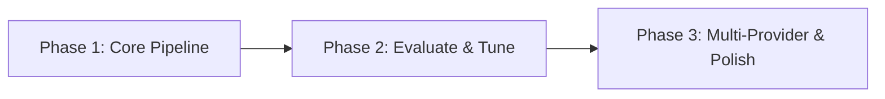

# Roadmap: TextToSQLFlow

**[3 phases]** | **[19 requirements mapped]** | All v1 requirements covered ✓

| # | Phase | Goal | Requirements | Success Criteria |
|---|-------|------|--------------|------------------|
| 1 | Core Pipeline | Xây dựng pipeline cơ bản: CLI nhận mô tả → LLM gen flow → parse/validate → JSON output | CLI-01, CLI-02, CLI-05, GEN-01, GEN-02, GEN-03, GEN-04, GEN-05, OUT-01 | 4 |
| 2 | Evaluate & Tune | Thêm evaluation loop: đánh giá chất lượng → tune → loop → auto/interactive mode | CLI-06, EVAL-01, EVAL-02, EVAL-03, EVAL-04, EVAL-05, EVAL-06 | 5 |
| 3 | Multi-Provider & Polish | Hỗ trợ nhiều LLM provider + HTML report + config file | CLI-03, CLI-04, OUT-02 | 3 |

---

### Phase Details

**Phase 1: Core Pipeline**
**Goal:** Xây dựng pipeline cơ bản: CLI nhận mô tả → LLM gen flow → parse/validate → JSON output
**Mode:** mvp
**Requirements:** CLI-01, CLI-02, CLI-05, GEN-01, GEN-02, GEN-03, GEN-04, GEN-05, OUT-01
**Success Criteria:**
1. User chạy `text-to-sql-flow generate "mô tả" --output ./out` và nhận file JSON
2. JSON output đúng schema Flow → Steps → Output với Pydantic validate
3. LLM trả JSON malformed → tự động retry tối đa 3 lần
4. Output JSON ghi ra file thành công

**Phase 2: Evaluate & Tune**
**Goal:** Thêm evaluation loop: LLM đánh giá chất lượng → tune prompt → loop → auto/interactive mode
**Mode:** mvp
**Requirements:** CLI-06, EVAL-01, EVAL-02, EVAL-03, EVAL-04, EVAL-05, EVAL-06
**Success Criteria:**
1. LLM đánh giá flow với rubric và trả score + feedback
2. Score < threshold → tune prompt với feedback → re-generate
3. Loop dừng khi score >= threshold hoặc max 5 iterations
4. `--auto` chạy tự động không cần confirm
5. `--interactive` dừng ở mỗi iteration cho user review

**Phase 3: Multi-Provider & Polish**
**Goal:** Hỗ trợ nhiều LLM provider + HTML report + config file
**Mode:** mvp
**Requirements:** CLI-03, CLI-04, OUT-02
**Success Criteria:**
1. Config YAML cho phép cấu hình provider, API key, model params
2. `--provider` flag chọn provider (openai, claude, deepseek, nvidia, openrouter, opencode)
3. HTML report hiển thị flow diagram + evaluation results

---

## Phase Dependencies

- Phase 1 độc lập (có thể chạy trước)
- Phase 2 phụ thuộc Phase 1 (cần pipeline để evaluate)
- Phase 3 có thể chạy song song với Phase 2 (config file độc lập với evaluate loop)

## Notes

- **Parallel execution:** phase 3 có thể bắt đầu sau khi phase 1 hoàn thành (không cần đợi phase 2)
- **POC scope:** Phase 1 dùng 1 provider cụ thể (OpenAI), mở rộng ở Phase 3
- **MVP**: Mỗi phase deliver end-to-end slice, user có thể dùng được ngay sau mỗi phase

---
*Roadmap created: 2026-07-01*
