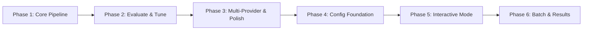

# Roadmap: TextToSQLFlow

**[3 phases (v1.0)] + [3 phases (v1.1)]** | **[19 v1.0 + 9 v1.1 requirements mapped]** | All requirements covered ✓

| # | Phase | Goal | Requirements | Success Criteria |
|---|-------|------|--------------|------------------|
| 1 | Core Pipeline | Pipeline cơ bản: CLI nhận mô tả → LLM gen flow → parse/validate → JSON output | CLI-01, CLI-02, CLI-05, GEN-01, GEN-02, GEN-03, GEN-04, GEN-05, OUT-01 | 4 |
| 2 | Evaluate & Tune | Evaluation loop: đánh giá chất lượng → tune → loop → auto/interactive mode | CLI-06, EVAL-01, EVAL-02, EVAL-03, EVAL-04, EVAL-05, EVAL-06 | 5 |
| 3 | Multi-Provider & Polish | Hỗ trợ nhiều LLM provider + HTML report + config file | CLI-03, CLI-04, OUT-02 | 3 |
| 4 | Config Foundation | .env API key loading + default provider tối ưu | CFG-01, CFG-02 | 3 |
| 5 | Interactive Mode | Rich CLI interactive mode: nhập mô tả, chọn provider, nhập key, REPL loop | GUI-01, GUI-02, GUI-03, GUI-04 | 4 |
| 6 | Batch & Results | Batch mode + result summary + re-generate flow cũ | GUI-05, GUI-06, GUI-07 | 4 |

---

### Phase Details

## v1.0 (Completed)

**Phase 1: Core Pipeline**
**Goal:** Xây dựng pipeline cơ bản: CLI nhận mô tả → LLM gen flow → parse/validate → JSON output
**Mode:** mvp
**Walking Skeleton:** Complete
**Requirements:** CLI-01, CLI-02, CLI-05, GEN-01, GEN-02, GEN-03, GEN-04, GEN-05, OUT-01
**Plans:** 3 plans in 3 waves
**Success Criteria:**
1. User chạy `text-to-sql-flow generate "mô tả" --output ./out` và nhận file JSON
2. JSON output đúng schema Flow → Steps → Output với Pydantic validate
3. LLM trả JSON malformed → tự động retry tối đa 3 lần
4. Output JSON ghi ra file thành công

**Plans:**
- [ ] 01-01-PLAN.md — Project scaffold + Pydantic types + CLI entry point
- [ ] 01-02-PLAN.md — Core pipeline: LLM client, prompt, parser, writer, pipeline controller
- [ ] 01-03-PLAN.md — Tests: unit tests + integration tests with mocked LLM

**Phase 2: Evaluate & Tune**
**Goal:** Thêm evaluation loop: LLM đánh giá chất lượng → tune prompt → loop → auto/interactive mode
**Mode:** mvp
**Requirements:** CLI-06, EVAL-01, EVAL-02, EVAL-03, EVAL-04, EVAL-05, EVAL-06
**Plans:** 3 plans in 3 waves
**Success Criteria:**
1. LLM đánh giá flow với rubric và trả score + feedback
2. Score < threshold → tune prompt với feedback → re-generate
3. Loop dừng khi score >= threshold hoặc max 5 iterations
4. `--auto` chạy tự động không cần confirm
5. `--interactive` dừng ở mỗi iteration cho user review

**Plans:**
- [x] 02-01-PLAN.md — Evaluator module: rubric prompt, score parsing, evaluate_flow function
- [x] 02-02-PLAN.md — Loop + CLI: evaluate-tune loop, --auto/--interactive flags, Rich progress bar
- [x] 02-03-PLAN.md — Tests: evaluator unit tests, pipeline loop tests, CLI flag tests

**Phase 3: Multi-Provider & Polish**
**Goal:** Hỗ trợ nhiều LLM provider + HTML report + config file
**Mode:** mvp
**Requirements:** CLI-03, CLI-04, OUT-02
**Plans:** 3 plans in 2 waves
**Success Criteria:**
1. Config YAML cho phép cấu hình provider, API key, model params
2. `--provider` flag chọn provider (openai, claude, deepseek, nvidia, openrouter, opencode)
3. HTML report hiển thị flow diagram + evaluation results

**Plans:**
- [x] 03-01-PLAN.md — Config module + litellm multi-provider abstraction
- [x] 03-02-PLAN.md — HTML report renderer (Jinja2, dark theme)
- [x] 03-03-PLAN.md — Wire CLI + pipeline with --provider, --config, --html flags

## v1.1 (Current Milestone)

### Phase 4: Config Foundation
**Goal:** User can configure API keys via `.env` file and use the optimal default provider without manual flags
**Depends on**: Phase 3 (Multi-Provider & Polish)
**Requirements**: CFG-01, CFG-02
**Success Criteria** (what must be TRUE):
1. User places `OPENAI_API_KEY=sk-...` in `.env` file → tool loads it automatically without `--api-key` or config YAML
2. User runs tool without `--provider` flag → tool uses `opencode/deepseek-v4-flash-free` by default
3. API key priority chain is honored: `.env` > environment variable > config YAML > error prompt
**Plans**: TBD

### Phase 5: Interactive Mode
**Goal:** User can generate multiple flows through an interactive rich CLI without remembering flags or config details
**Depends on**: Phase 4 (Config Foundation)
**Requirements**: GUI-01, GUI-02, GUI-03, GUI-04
**Success Criteria** (what must be TRUE):
1. User runs interactive mode and inputs multiple business descriptions one after another in the same session
2. User selects a provider from an interactive rich list (not `--provider` flag), showing available options with descriptions
3. If selected provider has no API key in `.env` / env var / config, tool prompts user to enter it inline
4. After each flow generation, tool asks "Generate another? (y/n)" — user can continue or exit
**Plans**: TBD
**UI hint**: yes

### Phase 6: Batch & Results
**Goal:** User can process descriptions from a file, view a consolidated summary of all generated flows, and regenerate any past flow with different settings
**Depends on**: Phase 5 (Interactive Mode)
**Requirements**: GUI-05, GUI-06, GUI-07
**Success Criteria** (what must be TRUE):
1. User runs batch mode pointing to a `.txt` file with one description per line → tool generates flows for all descriptions
2. After interactive or batch session, user sees a summary table showing all flows: ID, description, provider, status, timestamp
3. User can select a previously generated flow from the summary and regenerate it with a different provider or config
4. Any flow displayed in the summary can be selected as source for re-generation
**Plans**: TBD
**UI hint**: yes

---

## Phase Dependencies

- Phase 1-3: v1.0 (completed)
- Phase 4 độc lập tương đối — có thể chạy trước Phase 5 (cần .env + default provider cho interactive mode)
- Phase 5 phụ thuộc Phase 4 (cần .env loading + default provider trước)
- Phase 6 phụ thuộc Phase 5 (cần interactive mode để có session history cho summary + re-gen)

## Notes

- **v1.0 (Phases 1-3)**: Complete. All 19 requirements implemented.
- **v1.1 (Phases 4-6)**: Focus on UX — rich interactive CLI replaces raw flag-based usage for common workflows.
- **Granularity**: Coarse (3 phases for 9 v1.1 requirements).
- **No UI framework**: All interactive UI is rich-based (terminal), not web.

## Coverage

| Requirement | Phase |
|-------------|-------|
| CFG-01 | Phase 4 |
| CFG-02 | Phase 4 |
| GUI-01 | Phase 5 |
| GUI-02 | Phase 5 |
| GUI-03 | Phase 5 |
| GUI-04 | Phase 5 |
| GUI-05 | Phase 6 |
| GUI-06 | Phase 6 |
| GUI-07 | Phase 6 |

**Coverage: 9/9 v1.1 requirements mapped ✓**

---
*Roadmap updated: 2026-07-01 (v1.1 phases 4-6 added)*
