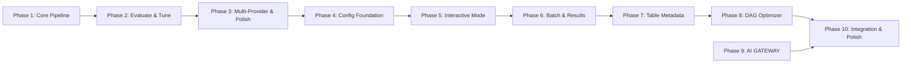

# Roadmap: TextToSQLFlow

**[3 phases (v1.0)] + [3 phases (v1.1)] + [4 phases (v1.2)]** | **[19 v1.0 + 9 v1.1 + 22 v1.2 requirements mapped]** | All requirements covered ✓

| # | Phase | Goal | Requirements | Success Criteria |
|---|-------|------|--------------|------------------|
| 1 | Core Pipeline | Pipeline cơ bản: CLI nhận mô tả → LLM gen flow → parse/validate → JSON output | CLI-01, CLI-02, CLI-05, GEN-01, GEN-02, GEN-03, GEN-04, GEN-05, OUT-01 | 4 |
| 2 | Evaluate & Tune | Evaluation loop: đánh giá chất lượng → tune → loop → auto/interactive mode | CLI-06, EVAL-01, EVAL-02, EVAL-03, EVAL-04, EVAL-05, EVAL-06 | 5 |
| 3 | Multi-Provider & Polish | Hỗ trợ nhiều LLM provider + HTML report + config file | CLI-03, CLI-04, OUT-02 | 3 |
| 4 | Config Foundation ✅ | .env API key loading + default provider tối ưu | CFG-01, CFG-02 | 3 |
| 5 | Interactive Mode ✅ | Rich CLI interactive mode: nhập mô tả, chọn provider, nhập key, REPL loop | GUI-01, GUI-02, GUI-03, GUI-04 | 4 |
| 6 | Batch & Results ✅ | Batch mode + result summary + re-generate flow cũ | GUI-05, GUI-06, GUI-07 | 4 |
| 7 | Table Metadata | Kết hợp mô tả nghiệp vụ + table metadata (JSON/DDL) | TBL-01, TBL-02, TBL-03, TBL-04 | 3 |
| 8 | DAG Optimizer | Phân tích DAG, tối đa parallel execution | DAG-01, DAG-02, DAG-03, DAG-04, DAG-05 | 3 |
| 9 | AI GATEWAY | Standalone FastAPI service: routing, fallback, cost, rate limit, cache, audit | GW-01 → GW-10 | 5 |
| 10 | Integration & Polish | E2E tests, Docker Compose, docs | INT-01, INT-02, INT-03 | 2 |

---

### Phase Details

## v1.0 (Completed)

**Phase 1: Core Pipeline**
**Goal:** Xây dựng pipeline cơ bản: CLI nhận mô tả → LLM gen flow → parse/validate → JSON output
**Mode:** mvp
**Walking Skeleton:** Complete
**Requirements:** CLI-01, CLI-02, CLI-05, GEN-01, GEN-02, GEN-03, GEN-04, GEN-05, OUT-01
**Plans:** 3 plans in 3 waves
**Success Criteria:**
1. User chạy `text-to-sql-flow generate "mô tả" --output ./out` và nhận file JSON
2. JSON output đúng schema Flow → Steps → Output với Pydantic validate
3. LLM trả JSON malformed → tự động retry tối đa 3 lần
4. Output JSON ghi ra file thành công

**Plans:**
- [ ] 01-01-PLAN.md — Project scaffold + Pydantic types + CLI entry point
- [ ] 01-02-PLAN.md — Core pipeline: LLM client, prompt, parser, writer, pipeline controller
- [ ] 01-03-PLAN.md — Tests: unit tests + integration tests with mocked LLM

**Phase 2: Evaluate & Tune**
**Goal:** Thêm evaluation loop: LLM đánh giá chất lượng → tune prompt → loop → auto/interactive mode
**Mode:** mvp
**Requirements:** CLI-06, EVAL-01, EVAL-02, EVAL-03, EVAL-04, EVAL-05, EVAL-06
**Plans:** 3 plans in 3 waves
**Success Criteria:**
1. LLM đánh giá flow với rubric và trả score + feedback
2. Score < threshold → tune prompt với feedback → re-generate
3. Loop dừng khi score >= threshold hoặc max 5 iterations
4. `--auto` chạy tự động không cần confirm
5. `--interactive` dừng ở mỗi iteration cho user review

**Plans:**
- [x] 02-01-PLAN.md — Evaluator module: rubric prompt, score parsing, evaluate_flow function
- [x] 02-02-PLAN.md — Loop + CLI: evaluate-tune loop, --auto/--interactive flags, Rich progress bar
- [x] 02-03-PLAN.md — Tests: evaluator unit tests, pipeline loop tests, CLI flag tests

**Phase 3: Multi-Provider & Polish**
**Goal:** Hỗ trợ nhiều LLM provider + HTML report + config file
**Mode:** mvp
**Requirements:** CLI-03, CLI-04, OUT-02
**Plans:** 3 plans in 2 waves
**Success Criteria:**
1. Config YAML cho phép cấu hình provider, API key, model params
2. `--provider` flag chọn provider (openai, claude, deepseek, nvidia, openrouter, opencode)
3. HTML report hiển thị flow diagram + evaluation results

**Plans:**
- [x] 03-01-PLAN.md — Config module + litellm multi-provider abstraction
- [x] 03-02-PLAN.md — HTML report renderer (Jinja2, dark theme)
- [x] 03-03-PLAN.md — Wire CLI + pipeline with --provider, --config, --html flags

## v1.1 (Completed)

### Phase 4: Config Foundation ✅
**Goal:** User can configure API keys via `.env` file and use the optimal default provider without manual flags
**Depends on**: Phase 3 (Multi-Provider & Polish)
**Requirements**: CFG-01, CFG-02
**Success Criteria** (what must be TRUE):
1. User places `OPENAI_API_KEY=sk-...` in `.env` file → tool loads it automatically without `--api-key` or config YAML
2. User runs tool without `--provider` flag → tool uses `opencode/deepseek-v4-flash-free` by default
3. API key priority chain is honored: `.env` > environment variable > config YAML > error prompt
**Plans**: [x] 04-01-PLAN.md — .env loader + default provider

### Phase 5: Interactive Mode ✅
**Goal:** User can generate multiple flows through an interactive rich CLI without remembering flags or config details
**Depends on**: Phase 4 (Config Foundation)
**Requirements**: GUI-01, GUI-02, GUI-03, GUI-04
**Success Criteria** (what must be TRUE):
1. User runs interactive mode and inputs multiple business descriptions one after another in the same session
2. User selects a provider from an interactive rich list (not `--provider` flag), showing available options with descriptions
3. If selected provider has no API key in `.env` / env var / config, tool prompts user to enter it inline
4. After each flow generation, tool asks "Generate another? (y/n)" — user can continue or exit
**Plans**: [x] 05-01-PLAN.md — interactive mode (interactive.py + cli.py)

### Phase 6: Batch & Results ✅
**Goal:** User can process descriptions from a file, view a consolidated summary of all generated flows, and regenerate any past flow with different settings
**Depends on**: Phase 5 (Interactive Mode)
**Requirements**: GUI-05, GUI-06, GUI-07
**Success Criteria** (what must be TRUE):
1. User runs batch mode pointing to a `.txt` file with one description per line → tool generates flows for all descriptions
2. After interactive or batch session, user sees a summary table showing all flows: ID, description, provider, status, timestamp
3. User can select a previously generated flow from the summary and regenerate it with a different provider or config
4. Any flow displayed in the summary can be selected as source for re-generation
**Plans**: [x] 06-01-PLAN.md — batch + results

## v1.2 (Current Milestone)

### Phase 7: Table Metadata
**Goal:** User can provide table schema info (JSON/DDL) alongside business description. Tool parses metadata and feeds it into the LLM prompt for more accurate SQL flow generation.
**Depends on**: Phase 6 (Batch & Results)
**Requirements**: TBL-01, TBL-02, TBL-03, TBL-04
**Mode:** standard
**Success Criteria** (what must be TRUE):
1. User runs `--tables schema.json` and tool parses tables, columns, types, keys, partitions
2. User runs `--tables schema.ddl` and tool auto-detects DDL, parses CREATE TABLE statements
3. LLM receives table metadata in prompt and generates flow referencing actual column names and join keys
4. Generated SQL uses correct column names, join conditions reference defined keys

### Phase 8: DAG Optimizer
**Goal:** Optimize generated flow's DAG for maximum parallel execution. Hybrid approach: LLM generates initial DAG, Optimizer fine-tunes.
**Depends on**: Phase 7 (Table Metadata)
**Requirements**: DAG-01, DAG-02, DAG-03, DAG-04, DAG-05
**Mode:** standard
**Success Criteria** (what must be TRUE):
1. Optimizer analyzes dependency graph and detects parallel opportunities
2. Optimizer adjusts `steps.order` to maximize parallel execution
3. Optimizer can suggest intermediate steps to enable more parallelism
4. User can review optimization results and accept/override in interactive mode
5. `--no-optimize` flag disables optimizer (passthrough raw LLM output)

### Phase 9: AI GATEWAY
**Goal:** Standalone FastAPI service acting as LLM proxy: routing, fallback, cost tracking, rate limiting, caching, audit logging, RBAC. CLI tool calls gateway instead of LLM directly.
**Depends on**: None (can build independently of Phases 7-8)
**Requirements**: GW-01 → GW-10
**Mode:** standard
**Success Criteria** (what must be TRUE):
1. Gateway starts as standalone FastAPI service with `/v1/chat/completions` endpoint
2. Routing rules match description patterns → specific provider/model
3. Primary provider fails → automatic fallback to secondary provider
4. Each request logged with token count, cost estimate, provider used
5. Rate limit enforced per provider (RPM configurable)
6. Cache returns cached response for identical prompts within TTL
7. Audit log records request metadata (not payload) for compliance
8. RBAC maps API keys to allowed providers and rate limit profiles
9. Gateway configured via `gateway.yaml`
10. CLI `--gateway-url` flag routes all LLM calls through gateway

### Phase 10: Integration & Polish
**Goal:** End-to-end integration tests, Docker Compose for dev environment, documentation updates.
**Depends on**: Phases 7, 8, 9
**Requirements**: INT-01, INT-02, INT-03
**Mode:** quick
**Success Criteria** (what must be TRUE):
1. Integration test covers: CLI + Table Metadata → DAG Optimizer → Gateway → output
2. `docker-compose up` starts both CLI dev env and Gateway service
3. README updated with all v1.2 features and Gateway setup guide

---

## Phase Dependencies

- Phase 1-6: v1.0-v1.1 (completed)
- Phase 7 độc lập tương đối — mở rộng prompt + parser, không ảnh hưởng core pipeline
- Phase 8 phụ thuộc Phase 7 (cần metadata để có flow chính xác trước khi optimize)
- Phase 9 độc lập — có thể build song song với Phases 7-8
- Phase 10 phụ thuộc tất cả phase trước (integration test)

## Notes

- **v1.0 (Phases 1-3)**: Complete. All 19 requirements implemented.
- **v1.1 (Phases 4-6)**: Complete. All 9 requirements implemented.
- **v1.2 (Phases 7-10)**: Table metadata input, DAG optimization, AI GATEWAY service.
- **Granularity**: 4 phases for 22 v1.2 requirements.
- **Approach**: Monorepo — CLI + Gateway cùng repo, shared types.
- **SQLWF**: Deferred until spec available.

## Coverage

| Requirement | Phase |
|-------------|-------|
| TBL-01 | Phase 7 |
| TBL-02 | Phase 7 |
| TBL-03 | Phase 7 |
| TBL-04 | Phase 7 |
| DAG-01 | Phase 8 |
| DAG-02 | Phase 8 |
| DAG-03 | Phase 8 |
| DAG-04 | Phase 8 |
| DAG-05 | Phase 8 |
| GW-01 | Phase 9 |
| GW-02 | Phase 9 |
| GW-03 | Phase 9 |
| GW-04 | Phase 9 |
| GW-05 | Phase 9 |
| GW-06 | Phase 9 |
| GW-07 | Phase 9 |
| GW-08 | Phase 9 |
| GW-09 | Phase 9 |
| GW-10 | Phase 9 |
| INT-01 | Phase 10 |
| INT-02 | Phase 10 |
| INT-03 | Phase 10 |

**Coverage: 22/22 v1.2 requirements mapped ✓**

---
*Roadmap updated: 2026-07-06 (v1.2 initialization)*
